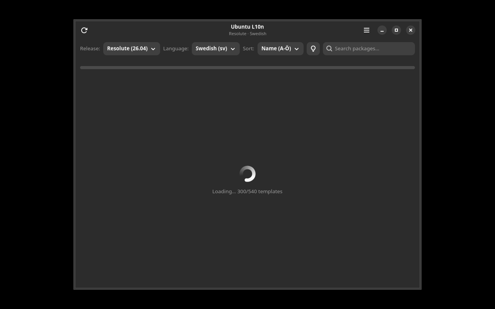

# Ubuntu L10n

A GTK4/Adwaita application for viewing Ubuntu translation statistics from Launchpad.



## Features

- Translation status per package (translated/untranslated/fuzzy)
- Color-coded progress bars (green/yellow/red)
- Language selector (defaults to system language)
- Distribution selector: Resolute (26.04), Questing, Plucky, Oracular, Noble, Focal
- Search/filter packages
- Sort by most/least translated
- Click any package to open its Launchpad translation page
- Overall progress bar with summary statistics

## Installation

### Debian/Ubuntu

```bash
# Add repository
curl -fsSL https://yeager.github.io/debian-repo/KEY.gpg | sudo gpg --dearmor -o /usr/share/keyrings/yeager-archive-keyring.gpg
echo "deb [signed-by=/usr/share/keyrings/yeager-archive-keyring.gpg] https://yeager.github.io/debian-repo stable main" | sudo tee /etc/apt/sources.list.d/yeager.list
sudo apt update
sudo apt install ubuntu-l10n
```

### Fedora/RHEL

```bash
sudo dnf config-manager --add-repo https://yeager.github.io/rpm-repo/yeager.repo
sudo dnf install ubuntu-l10n
```

### From source

```bash
pip install .
ubuntu-l10n
```

## 🌍 Contributing Translations

This app is translated via Transifex. Help translate it into your language!

**[→ Translate on Transifex](https://app.transifex.com/danielnylander/ubuntu-l10n/)**

Currently supported: Swedish (sv). More languages welcome!

### For Translators
1. Create a free account at [Transifex](https://www.transifex.com)
2. Join the [danielnylander](https://app.transifex.com/danielnylander/) organization
3. Start translating!

Translations are automatically synced via GitHub Actions.
## License

GPL-3.0-or-later — Daniel Nylander <daniel@danielnylander.se>
